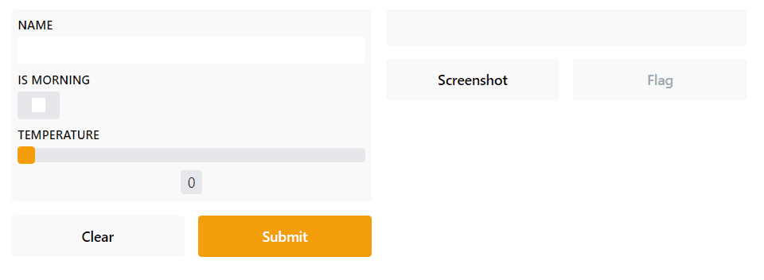
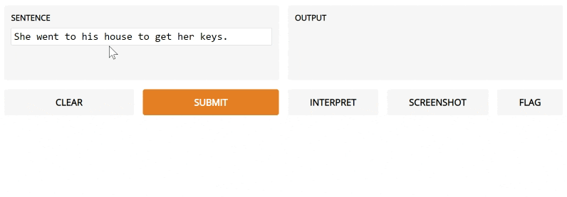
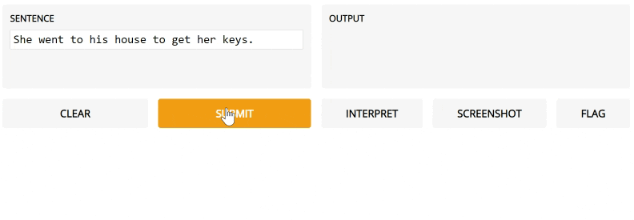

[](https://circleci.com/gh/gradio-app/gradio)  [](https://badge.fury.io/py/gradio)

#  Welcome to Gradio

Quickly create customizable UI components around your models. Gradio makes it easy for you to "play around" with your model in your browser by dragging-and-dropping in your own images, pasting your own text, recording your own voice, etc. and seeing what the model outputs.  


Gradio is useful for:

* Creating demos of your machine learning code for clients / collaborators / users

* Getting feedback on model performance from users

* Debugging your model interactively during development


## Getting Started
You can find an interactive version of this README at [https://gradio.app/getting_started](https://gradio.app/getting_started).

### Quick Start

To get Gradio running with a simple example, follow these three steps:

1. Install Gradio from pip.
````bash
pip install gradio
````

2. Run the code below as a Python script or in a Python notebook (or in a  [colab notebook](https://colab.research.google.com/drive/18ODkJvyxHutTN0P5APWyGFO_xwNcgHDZ?usp=sharing)).

````python
import gradio as gr

def greet(name):
  return "Hello " + name + "!"

iface = gr.Interface(fn=greet, inputs="text", outputs="text")
iface.launch()
````

3. The interface below will appear automatically within the Python notebook, or pop in a browser on  [http://localhost:7860](http://localhost:7860/)  if running from a script.


### The Interface

Gradio can wrap almost any Python function with an easy to use interface. That function could be anything from a simple tax calculator to a pretrained model.

The core  `Interface`  class is initialized with three parameters:

-   `fn`: the function to wrap
-   `inputs`: the input component type(s)
-   `outputs`: the output component type(s)

With these three arguments, we can quickly create interfaces and  `launch()`  them. But what if you want to change how the UI components look or behave?

### Customizable Components

What if we wanted to customize the input text field - for example, we wanted it to be larger and have a text hint? If we use the actual input class for  `Textbox`  instead of using the string shortcut, we have access to much more customizability. To see a list of all the components we support and how you can customize them, check out the [Docs](https://gradio.app/docs)

````python
import gradio as gr

def greet(name):
  return "Hello " + name + "!"

iface = gr.Interface(
  fn=greet, 
  inputs=gr.inputs.Textbox(lines=2, placeholder="Name Here..."), 
  outputs="text")
iface.launch()
````


### Multiple Inputs and Outputs

Let's say we had a much more complex function, with multiple inputs and outputs. In the example below, we have a function that takes a string, boolean, and number, and returns a string and number. Take a look how we pass a list of input and output components.

````python
import gradio as gr

def greet(name, is_morning, temperature):
  salutation = "Good morning" if is_morning else "Good evening"
  greeting = "%s %s. It is %s degrees today" % (
    salutation, name, temperature)
  celsius = (temperature - 32) * 5 / 9
  return greeting, round(celsius, 2)

iface = gr.Interface(
  fn=greet, 
  inputs=["text", "checkbox", gr.inputs.Slider(0, 100)],
  outputs=["text", "number"])
iface.launch()
````


We simply wrap the components in a list. Furthermore, if we wanted to compare multiple functions that have the same input and return types, we can even pass a list of functions for quick comparison.

### Working with Images

Let's try an image to image function. When using the  `Image`  component, your function will receive a numpy array of your specified size, with the shape  `(width, height, 3)`, where the last dimension represents the RGB values. We'll return an image as well in the form of a numpy array.

````python
import gradio as gr
import numpy as np

def sepia(img):
  sepia_filter = np.array([[.393, .769, .189],
                           [.349, .686, .168],
                           [.272, .534, .131]])
  sepia_img = img.dot(sepia_filter.T)
  sepia_img /= sepia_img.max()                          
  return sepia_img

iface = gr.Interface(sepia, gr.inputs.Image(shape=(200, 200)), "image")
iface.launch()
````


Additionally, our  `Image`  input interface comes with an 'edit' button which opens tools for cropping, flipping, rotating, drawing over, and applying filters to images. We've found that manipulating images in this way will often reveal hidden flaws in a model.

### Example Data

You can provide example data that a user can easily load into the model. This can be helpful to demonstrate the types of inputs the model expects, as well as to provide a way to explore your dataset in conjunction with your model. To load example data, you provide a nested list to the  `examples=`  keyword argument of the Interface constructor. Each sublist within the outer list represents a data sample, and each element within the sublist represents an input for each input component. The format of example data for each component is specified in the  [Docs](https://gradio.app/docs).

````python
import gradio as gr

def calculator(num1, operation, num2):
    if operation == "add":
        return num1 + num2
    elif operation == "subtract":
        return num1 - num2
    elif operation == "multiply":
        return num1 * num2
    elif operation == "divide":
        return num1 / num2


iface = gr.Interface(calculator, 
    ["number", gr.inputs.Radio(["add", "subtract", "multiply", "divide"]), "number"],
    "number",
    examples=[
        [5, "add", 3],
        [12, "divide", -2]
    ]
)
iface.launch()
````


### Flagging

Underneath the output interfaces, there is a button marked "Flag". When a user testing your model sees input with interesting output, such as erroneous or unexpected model behaviour, they can flag the input for review. Within the directory provided by the  `flagging_dir=`  argument to the Interface constructor, a CSV file will log the flagged inputs. If the interface involved file inputs, such as for Image and Audio interfaces, folders will be created to store those flagged inputs as well.

You can review these flagged inputs by manually exploring the flagging directory, or load them into the Gradio interface by pointing the  `examples=`  argument to the flagged CSV file.

### Interpretation

Most models are black boxes such that the internal logic of the function is hidden from the end user. To encourage transparency, we've added the ability for interpretation so that users can understand what parts of the input are responsible for the output. Take a look at the simple interface below:

````python
import gradio as gr
import re

male_words, female_words = ["he", "his", "him"], ["she", "her"]
def gender_of_sentence(sentence):
  male_count = len([word for word in sentence.split() if word.lower() in male_words])
  female_count = len([word for word in sentence.split() if word.lower() in female_words])
  total = max(male_count + female_count, 1)
  return {"male": male_count / total, "female": female_count / total}

iface = gr.Interface(
  fn=gender_of_sentence, inputs=gr.inputs.Textbox(default="She went to his house to get her keys."),
  outputs="label", interpretation="default")
iface.launch()

````


Notice the  `interpretation`  keyword argument. We're going to use Gradio's default interpreter here. After you submit and click Interpret, you'll see the interface automatically highlights the parts of the text that contributed to the final output orange! The parts that conflict with the output are highlight blue.

Gradio's default interpretation works with single output type interfaces, where the output is either a Label or Number. We're working on expanding the default interpreter to be much more customizable and support more interfaces.

You can also write your own interpretation function. The demo below adds custom interpretation to the previous demo. This function will take the same inputs as the main wrapped function. The output of this interpretation function will be used to highlight the input of each input interface - therefore the number of outputs here corresponds to the number of input interfaces. To see the format for interpretation for each input interface, check the [Docs](https://gradio.app/docs).

````python
import gradio as gr
import re

male_words, female_words = ["he", "his", "him"], ["she", "her"]
def gender_of_sentence(sentence):
  male_count = len([word for word in sentence.split() if word.lower() in male_words])
  female_count = len([word for word in sentence.split() if word.lower() in female_words])
  total = max(male_count + female_count, 1)
  return {"male": male_count / total, "female": female_count / total}

def interpret_gender(sentence):
  result = gender_of_sentence(sentence)
  is_male = result["male"] > result["female"]
  interpretation = []
  for word in re.split('( )', sentence):
    score = 0
    token = word.lower()
    if (is_male and token in male_words) or (not is_male and token in female_words):
      score = 1
    elif  (is_male and token in female_words) or (not is_male and token in male_words):
      score = -1
    interpretation.append((word, score))
  return interpretation

iface = gr.Interface(
  fn=gender_of_sentence, inputs=gr.inputs.Textbox(default="She went to his house to get her keys."),
  outputs="label", interpretation=interpret_gender)
iface.launch()
````


##  Contributing:

If you would like to contribute and your contribution is small, you can directly open a pull request (PR). If you would like to contribute a larger feature, we recommend first creating an issue with a proposed design for discussion. Please see our contributing guidelines for more info.

##  License:

Gradio is licensed under the Apache License 2.0

##  See more:

You can find many more examples (like GPT-2, model comparison, multiple inputs, and numerical interfaces) as well as more info on usage on our website: www.gradio.app

See, also, the accompanying paper: ["Gradio: Hassle-Free Sharing and Testing of ML Models in the Wild"](https://arxiv.org/pdf/1906.02569.pdf), *ICML HILL 2019*, and please use the citation below.

```
@article{abid2019gradio,
title={Gradio: Hassle-Free Sharing and Testing of ML Models in the Wild},
author={Abid, Abubakar and Abdalla, Ali and Abid, Ali and Khan, Dawood and Alfozan, Abdulrahman and Zou, James},
journal={arXiv preprint arXiv:1906.02569},
year={2019}
}
```